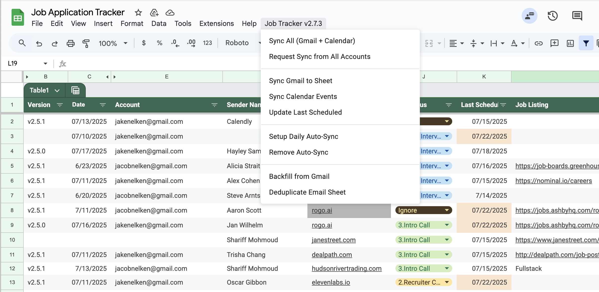

# Gmail Status Tracker

A Google Apps Script that automatically exports labeled Gmail emails to a Google Sheets spreadsheet for status tracking and organization.

## Features

- **Gmail & Calendar Integration** - Tracks both emails and calendar events
- **Multi-Account Support** - Works across multiple Google accounts
- **Cross-Account Sync Coordination** - Trigger syncs for all accounts from any account
- **Automatic Scheduling** - Twice-daily auto-sync at 8 AM and 2 PM
- **Configuration Management** - Centralized config in dedicated "Configuration" sheet
- **Company/Organization Matching** - Links calendar events to emails by domain
- **Backfill Support** - Automatically fills missing data for existing entries
- **Column-order independent** (uses header mapping)
- **Duplicate prevention** via Thread ID and Event ID tracking
- **Compatible with Google Sheets Tables**
- **Custom menu integration**

## Menu Options

The Status Tracker adds a custom menu to your Google Sheet with the following options:

### Sync Operations

- **Sync All (Gmail + Calendar)** - Imports new emails and calendar events in one operation
- **Request Sync from All Accounts** - Triggers other accounts to sync within 5 minutes
- **Sync Gmail to Sheet** - Imports only new emails from Gmail with your configured label
- **Sync Calendar Events** - Imports only new calendar events based on date range settings
- **Update Last Scheduled** - Updates the "Last Scheduled" column for calendar events

### Automation Setup

- **Setup Daily Auto-Sync** - Creates triggers for automatic syncing at 8 AM and 2 PM
- **Remove Auto-Sync** - Removes all automatic sync triggers for this account

### Data Management

- **Backfill from Gmail** - Imports ALL labeled emails and fills missing data in existing rows
- **Deduplicate Email Sheet** - Removes duplicate emails based on Thread ID
- **Process Ignored Emails** - Moves emails with "Ignore" status to the "Ignored Emails" sheet

## Setup Instructions

### Initial Setup

1. Copy `env.example.gs` to `env.gs`
2. Update `SPREADSHEET_ID` in `env.gs` with your Google Sheets ID
3. Deploy to Apps Script: `clasp push`

### 1. Create Gmail Label

1. In Gmail, create a new label (e.g., "status-tracker")
2. Apply this label to emails you want to track

### 2. Set Up Google Apps Script

1. Install clasp: `npm install -g @google/clasp`
2. Login to clasp: `clasp login`
3. Create new Apps Script project: `clasp create --type standalone --title "Gmail Status Tracker"` (or other preferred name)
   - This automatically generates `.clasp.json` with your Script ID

### 3. Configure Environment

1. Copy `env.example.gs` to `env.gs`
2. Update `SPREADSHEET_ID` in `env.gs` with your Google Sheets ID
   - Find in your Google Sheets URL: `https://docs.google.com/spreadsheets/d/SPREADSHEET_ID/edit`

### 4. Grant Permissions

1. Run any function to trigger authorization
2. Click "Review permissions" → "Allow"
3. Script needs access to Gmail and Google Sheets

### 5. Deploy and Test

1. Deploy: `clasp push`
2. Test via custom menu in your Google Sheet

## Usage Tips

### Status Tracking & other manual columns

Statuses are manually updated; the script will not make adjustments to it. Therefore you can use whatever statuses you prefer to track by.

You are allowed to add any additional columns you need (such as "Notes" for example) and the script will continue to work.

### Backfilling

If you clear values populated by the script, using the "backfill" option is useful to re-populate them. This can be used in situations where the script has updated capabilities and you'd like to apply the new formatting for that column to already-tracked emails.

### Troubleshooting

- Check execution logs in Apps Script for errors
- Ensure Gmail label is spelled exactly as configured
- Verify edit permissions on Google Sheet

## Multi-Account Syncing

### How It Works

The Gmail Tracker supports **cross-account synchronization** using the shared spreadsheet as a coordination mechanism. Multiple Google accounts can access the same spreadsheet, and any account can trigger syncs for all other accounts. The "Account" column shows which inbox received the email.

### Manual Cross-Account Sync

**"Request Sync from All Accounts"** menu option:

1. Any account with access clicks this option
2. A timestamp is stored in the Configuration sheet
3. Other accounts' sync request triggers detect this request
4. All accounts sync within 5 minutes of the request

### Automatic Scheduling

**Twice-Daily Auto-Sync** runs automatically:

- **8:00 AM** - Morning sync (Gmail + Calendar)
- **2:00 PM** - Afternoon sync (Gmail + Calendar)

Each account needs to set up their own triggers via:

- Menu: "Setup Daily Auto-Sync"

### Account Setup Requirements

Each Google account that wants to participate needs to:

1. **Have editor access** to the shared spreadsheet
2. **Authorize the script** (first-time setup)
3. **Set up auto-sync triggers** via the menu
4. **Add "status-tracker" label** to relevant Gmail emails
